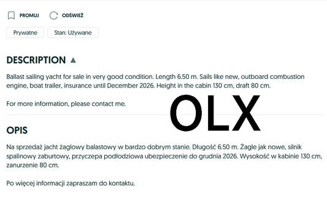
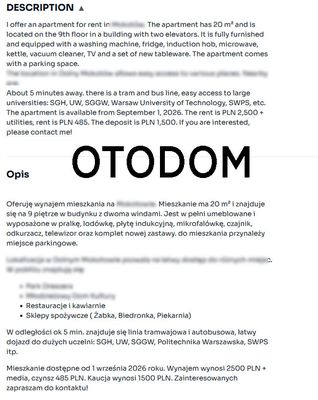
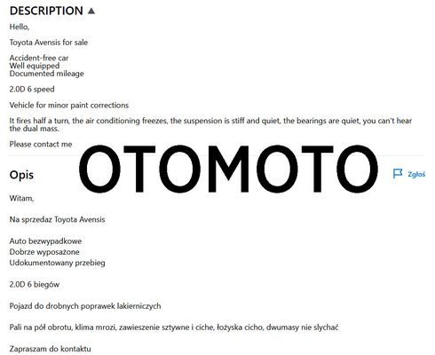

<div align="center">

  

  # Podil Translator

  **Automatic Browser Extension for Translating OLX, Otodom, and Otomoto Listings.**

  [](LICENSE)
  [](manifest.json)
  [](#installation)

</div>

---

## 📌 Overview

**Podil Translator** is a lightweight browser extension designed to eliminate language barriers when searching for real estate, cars, or second-hand items in Poland. 

It seamlessly detects description boxes on **OLX.pl**, **Otodom.pl**, and **Otomoto.pl** and translates Polish texts directly into English on the page without breaking layout or formatting.

---

## ✨ Features

- ⚡ **Automated In-Page Translation:** Instantly converts Polish listing descriptions into clear English.
- 🎯 **Platform-Specific Selectors:** Built specifically to target layout containers on:
  - [OLX.pl](https://www.olx.pl)
  - [Otodom.pl](https://www.otodom.pl)
  - [Otomoto.pl](https://www.otomoto.pl)
- 🔒 **Privacy Focused:** Minimal permissions requested; operates directly in your browser.
- 🎨 **Clean Native UI Integration:** Fits smoothly into each website's design.

---

## 📸 Screenshots & Previews

<div align="center">

### 1. OLX.pl Integration


### 2. Otodom.pl Integration


### 3. Otomoto.pl Integration


</div>

---

## 🚀 Installation

### 🛍️ Web Stores
* **Mozilla Firefox Add-ons:** [Get Podil Translator](https://addons.mozilla.org/en-US/firefox/addon/podil-translator/) (Under Review)
* **Chrome Web Store:** ⏳ *Coming Soon*

---

### 🔧 Manual Installation (Developer Mode)

1. Clone or download this repository:
   ```bash
   git clone https://github.com/AenR/podil-translator.git
   ```

2. Open chrome://extensions/ or about:debugging in your browser.

3. Enable Developer Mode and load the project folder using Load unpacked / Load Temporary Add-on.